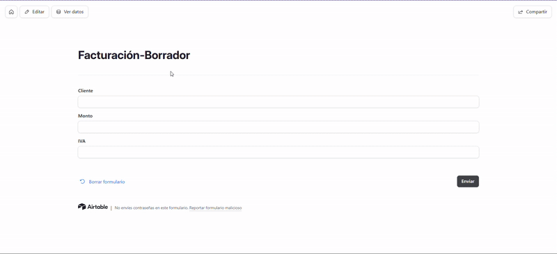
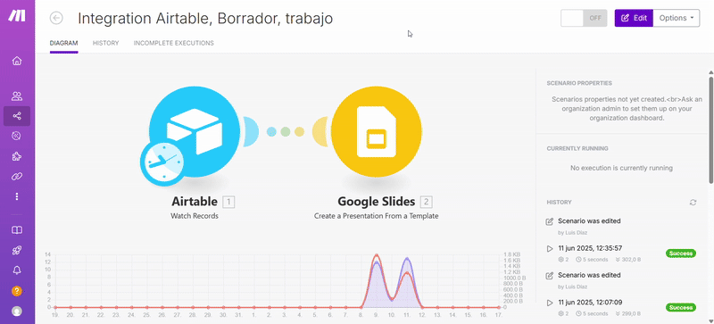

# MF0225_3 - Propuesta de solución para empresas con facturación en Excel  
**Autor: Luis Felipe Díaz Gutiérrez**

---

## Introducción

La gestión manual de facturas en Excel conlleva varios problemas: pérdida de tiempo, errores frecuentes en cálculos y falta de uniformidad en los formatos.  
Para solucionarlo, propongo un sistema integrado que utiliza herramientas accesibles y eficientes: Airtable como base de datos, Google Slides para el diseño de facturas y Make para automatizar los procesos.

Este enfoque no solo optimiza el tiempo, sino que también reduce errores y mejora la presentación profesional de las facturas.

---

## Base de Datos en Airtable

Además, Airtable permite crear formularios personalizados para añadir datos fácilmente a la base de datos.  
Esto facilita que cualquier persona pueda ingresar nueva información de facturación de forma ordenada, desde cualquier dispositivo.  
Con solo unos clics tras ingresar los datos, se puede ejecutar la automatización para generar facturas sin complicaciones.

Migramos los datos desde Excel a Airtable, una base de datos relacional en la nube. Airtable permite organizar la información en tablas interconectadas, como:

- Clientes (nombre, NIF, dirección, contacto)  
- Facturas (número, fecha, concepto, cantidades, impuestos, estado de pago)

**Ventajas:**  
Visualización flexible (calendarios, listas filtradas), vinculación de datos entre tablas.

---

## Diseño de Facturas en Google Slides

Usaremos Google Slides como herramienta de diseño:

- Plantilla con logo, datos fiscales y estructura base
- Campos variables (número, fecha, total) conectados con Airtable
- Exportación en PDF con nombre personalizado

---

## Automatización con Make

Make automatiza todo el proceso. Flujo:

1. Se añade una factura en Airtable → Make detecta el cambio  
2. Inserta los datos en la plantilla de Google Slides  
3. Convierte a PDF y guarda en Google Drive  
4. Envía el PDF por email y actualiza el estado en Airtable  
5. (Opcional) Recordatorios de pago o emisión de recibos

---

## Beneficios del Sistema

- Ahorro de tiempo
- Mayor precisión
- Imagen profesional
- Acceso remoto a los datos

---

## Conclusión y Próximos Pasos

**Resumen del sistema:**  
Airtable + Google Slides + Make = Sistema eficiente, escalable y de bajo coste

**Próximos pasos:**

- Migrar datos desde Excel  
- Diseñar plantillas  
- Configurar automatización  
- Ejecutar piloto inicial

---

## Creación de Esquema en Airtable

**Base de datos:** “Facturación Autónomos”

### Columnas principales:
1. Cliente  
2. Monto (sin IVA)  
3. IVA (10% o 21%)  
4. Total (calculado)  
5. Fecha de creación

**Ventajas:**  
Evita errores de cálculo, accesibilidad multiplataforma

---

## Preparación del archivo Excel

**Ejemplo:**

| Cliente     | Monto | IVA% | Total | Fecha      | N° Factura | Concepto     |
|-------------|-------|------|-------|------------|------------|--------------|
| Juan Pérez  | 500   | 21   | 605   | 01/06/2025 | F-001      | Diseño web   |
| María Gómez | 300   | 10   | 330   | 02/06/2025 | F-002      | Consultoría  |

### Reglas básicas:
- Columnas claras
- Fechas consistentes
- IVA sin símbolos
- Sin filas vacías

---

## Importar a Airtable

1. Guardar Excel como CSV  
2. Crear base en Airtable  
3. Importar CSV  
4. Verificar mapeo de columnas (Fecha = Date, Total = Number, IVA = Percent)

### Consejos:
- Probar con 5 filas
- Usar nombres simples
- Vista previa en Airtable

---

## Plantilla en Google Slides y Make

### En Airtable (Tabla "Facturas"):
- Número de factura
- Fecha
- Cliente
- Concepto
- Monto
- IVA%
- Total

### En Google Slides:
- Diseño profesional
- Campos dinámicos como `{{Cliente}}`, `{{Total}}`, etc.

### En Make:
1. Detecta nueva factura
2. Inserta en Slides
3. Exporta a PDF y guarda
4. (Opcional) Envía por correo

---

## Ventajas del Sistema

- No se necesita programar
- Diseño profesional y uniforme
- Organización en la nube

---

## Paso a Paso en Make

1. Crear nuevo escenario  
2. Configurar trigger con “Airtable - Watch Records”  
3. Conectar Google Slides con plantilla  
4. Establecer ejecución cada 15 minutos  
5. Revisar resultados  
6. (Opcional) Enviar por email, notificaciones

---

## Posibles Mejoras Futuras

1. Envío automático de facturas por email  
2. Recordatorios de pago  
3. Botones de pago (Stripe, PayPal)  
4. Sincronización contable (Holded, Quicken)  
5. Firma electrónica (DocuSign)  
6. Dashboard en Data Studio o Airtable  
7. Chatbot con ChatGPT

---

## Desenlace del Proyecto

Con este sistema:

- Nada de copiar/pegar manualmente  
- Facturas automáticas con un clic  
- Todo organizado en la nube  
- Escalable y adaptable  

**Resultado final:**  
Más tiempo para el negocio, menos burocracia, facturación impecable.
